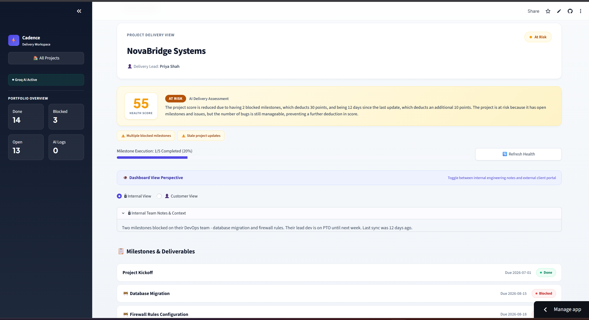

# 🚀 Cadence — AI-Powered Project Delivery Dashboard

> **Transform unstructured project updates into structured, trustworthy delivery intelligence with strict human-in-the-loop oversight.**

Cadence is an AI-powered project delivery intelligence workspace. It bridges the gap between chaotic, unstructured communication (emails, Slack messages, call notes) and structured project delivery state (milestones, health scores, risks, audit logs, and customer communication).

Built for the **FlytBase AI-Native Customer Teams Hackathon** and upgraded into a production-grade AI engineering portfolio application.

---

## 1. What is Cadence?

Cadence automates the ingestion, extraction, tracking, and customer communication lifecycle for complex delivery projects. Rather than allowing an LLM to blindly edit databases or send messages, Cadence uses an **AI Proposal Pattern** where the LLM proposes structured events, application logic validates them, humans review and approve them, and the database persists atomic state changes.

---

## 2. Problem

* **Communication Silos**: Critical delivery status updates are buried in emails, Slack threads, and meeting transcripts.
* **Stale Project Status**: Project managers manually gather status, leading to out-of-date dashboards.
* **Unreliable LLM Actions**: Naive AI implementations that directly mutate project databases risk hallucinations, state corruption, and silent data loss.
* **Leaked Internal Context**: Engineering notes and sensitive internal risks often spill over into external customer updates.

---

## 3. Solution

Cadence introduces a trustworthy AI delivery workflow:
1. **Ingests raw unstructured text** from team updates or Gmail integrations.
2. **Deterministic project matching** associates updates with the correct project or prompts for human selection on ambiguity.
3. **Structured Pydantic AI Extraction** identifies proposed milestone status changes, risks, and impacts.
4. **Validation & Idempotency** verifies entity ownership, allowed transition state matrices, and prevents duplicate processing via SHA-256 update hashing.
5. **Human-in-the-Loop Review** allows project leads to approve or reject proposed changes before database mutation.
6. **Deterministic Health Engine** calculates health scores in pure Python (`HEALTH_RULES`), ensuring 100% predictable scoring.
7. **Customer vs. Internal Safety Boundary** hides sensitive internal notes while generating structured customer status drafts.

---

## 4. Key Workflow

```text
Unstructured Communication (Email / Slack / Meeting Note)
                    │
                    ▼
           Integration Connector (Gmail / Ingestion)
                    │
                    ▼
          Deterministic Project Matching Engine
                    │
                    ▼
       Structured AI Extraction (Pydantic v2 + Groq API)
                    │
                    ▼
      Independent Validation (State Transitions & Idempotency)
                    │
                    ▼
    Human-in-the-Loop Decision Screen (Approve / Reject)
                    │
                    ▼
       Atomic Database Transaction & Activity Event Logging
                    │
                    ▼
    Deterministic Health & Grounded Risk Engine Recalculation
                    │
                    ▼
      Customer-Safe Status Draft (Human Review Mandatory)
```

---

## 5. Architecture Diagram

```text
                                  Streamlit UI Layer
                                       (app.py)
                                          │
        ┌─────────────────────────────────┼─────────────────────────────────┐
        ▼                                 ▼                                 ▼
Portfolio Overview Pages        Project Delivery View           AI Observability Dashboard
   (pages/overview.py)            (pages/detail.py)              (pages/observability.py)
        │                                 │                                 │
        └─────────────────────────────────┼─────────────────────────────────┘
                                          ▼
                               Service & Business Layer
                                  (utils/services.py)
                                          │
        ┌───────────────────┬─────────────┴─────┬───────────────────┐
        ▼                   ▼                   ▼                   ▼
 Ingestion Connector  Project Matching   Health & Risk Engines   Natural Language Engine
(integrations/gmail) (integrations/base) (utils/health_engine)   (utils/query_engine)
        │                   │                   │                   │
        └───────────────────┼───────────────────┴───────────────────┘
                            ▼
              Data Access & Repository Layer
                 (utils/repositories.py)
                            │
        ┌───────────────────┴───────────────────┐
        ▼                                       ▼
Persistent DB (SQLAlchemy)           Groq Cloud API (LLM Engine)
```

---

## 6. AI Architecture & Principles

> 🚨 **KEY ARCHITECTURAL PRINCIPLE**:  
> **"The LLM does not directly control application state. It produces structured proposals that are validated and require human approval before state changes."**

* **Pydantic v2 Validation**: All LLM JSON responses are strictly validated against Pydantic models (`ProjectUpdateAnalysis`, `StatusChangeProposal`, `RiskProposal`).
* **Confidence Scoring**: Each extraction includes confidence scores. Items are categorized as `HIGH` (>=85%), `MEDIUM` (60-84%), or `LOW` (<60%).
* **Idempotency**: SHA-256 update hashing prevents duplicate AI calls and duplicate database mutations.
* **Deterministic Health Scoring**: Health scores (0-100) are computed purely in Python (`HEALTH_RULES`). The LLM only generates narrative explanations of the calculated score.
* **No Direct SQL Execution**: Natural language queries use intent extraction (e.g. `STALE_PROJECTS`, `BLOCKED_MILESTONES`), Python queries parameterized SQLAlchemy models, and the LLM synthesizes readable explanations.

---

## 7. Database Architecture

Cadence uses **SQLAlchemy ORM** supporting persistent SQLite storage (`cadence.db`) and in-memory test databases:

| Table | Primary Key | Purpose & Attributes |
|---|---|---|
| `projects` | `id` | Delivery projects (`name`, `overall_status`, `owners`, `health_score`, `health_status`, `internal_notes`, `last_update`) |
| `milestones` | `id` | Project deliverables (`project_id`, `title`, `status`, `due_date`, `internal_only`, `completed_at`) |
| `issues` | `id` | Reported bugs & support items (`project_id`, `title`, `category`, `severity`, `status`, `internal_only`) |
| `risks` | `id` | Structured project risks (`project_id`, `title`, `severity`, `impact`, `recommended_action`, `source`, `status`) |
| `proposals` | `id` | Staged AI proposals prior to human review (`project_id`, `update_hash`, `raw_text`, `analysis_json`, `status`) |
| `project_updates` | `id` | Ingested update history (`project_id`, `raw_text`, `structured_summary`, `affected_milestone`, `is_ai_processed`) |
| `activity_events` | `id` | Immutable audit trail (`project_id`, `event_type`, `description`, `before_state`, `after_state`, `source`, `timestamp`) |
| `ai_events` | `id` | Telemetry logs (`project_id`, `update_id`, `event_type`, `model`, `latency_ms`, `confidence`, `input_summary`) |

---

## 8. Human-in-the-Loop Design

Every AI extraction creates a staged `ProposalDB` object. The UI displays an interactive **Human Review Card**:
* Displays proposed status changes (e.g. `Open → Done`) alongside confidence indicators.
* Provides `Approve All`, `Reject All`, and granular per-change checkboxes.
* Approving applies state changes inside an atomic DB transaction and logs an `ActivityEventDB`.
* Rejecting records an `AI_PROPOSAL_REJECTED` audit event without mutating project deliverables.

---

## 9. Key Portfolio Features

1. **Visual Project Delivery Timeline**: Kickoff events, target milestone dates, completions, blockers, and activity logs rendered in a clean visual CSS timeline.
2. **Structured "What Changed?" Audit Trail**: Activity history log showing `TIME`, `EVENT`, `BEFORE`, `AFTER`, `SOURCE`, and `ACTOR`.
3. **Natural-Language Project Query**: Intent-based structured querying (`Which milestones are blocked?`, `Which projects are stale?`) with safe parameterized execution.
4. **Actionable Recommended Actions**: Grounded risk cards displaying `Urgency`, `Impact`, `Recommended Action`, `Owner`, and `Affected Milestone`.
5. **Stale Project Intelligence**: Staleness detection identifying projects with no updates in >7 days, highlighting affected milestones and project leads.
6. **Integration Connector Architecture**: Clean `BaseIntegrationConnector` abstraction with a functional `GmailConnector` featuring domain and participant matching.
7. **Deterministic Project Matching**: Email and update ingestion matching with fallback to `"Project match uncertain - Human selection required"` on ambiguity.
8. **AI Observability Dashboard**: Real-time telemetry monitoring total AI events, latency averages, confidence trends, task distributions, and inspection logs.
9. **AI Event Details Inspection**: Deep-dive inspection into model parameters, input prompts, structured Pydantic outputs, and latency metrics.
10. **Customer View Safety Boundary**: Explicit toggle hiding internal engineering notes, raw updates, and internal risks from external client views.
11. **Customer Status Draft Generator**: AI status draft generator grounded in database metrics. **Mandatory human review; never auto-sent.**
12. **Grounded KPI Quality**: All dashboard numbers reconcile logically from active database entities.
13. **UI Polish**: B2B SaaS visual design, status badges, loading states, and error handling.
14. **Demo Mode**: One-click synthetic demo scenarios for Orion Logistics, NovaBridge, and Celera Health allowing full pipeline demos without external API credentials.

---

## 10. Screenshots & UI Layout

### Portfolio Overview & NL Query Engine


### Project Delivery View & Human Approval Screen


---

## 11. Demo Workflow (Step-by-Step)

For live interview or hackathon demonstrations:
1. Open **Cadence Dashboard** and select **Orion Logistics**.
2. Scroll to **Unstructured Communication & Event Processing**.
3. Click the **Demo Mode Scenario Chip**: `⚡ Orion Logistics — Firewall Approval Completed`.
4. Click **✨ Analyze Update with AI**.
5. Observe the **AI Proposal Screen** showing confidence levels and proposed status change (`Blocked → Done`).
6. Click **✅ Apply Approved**.
7. Observe the updated **Health Score**, updated **Milestone Execution Progress**, the new entry in the **Visual Timeline**, and the audited item in **"What Changed?" Activity History**.
8. Click **✨ Draft Customer Email** to generate a customer-ready status email grounded in the updated database state.

---

## 12. Tech Stack

* **Frontend**: Streamlit (Python)
* **LLM Engine**: Groq API (`qwen/qwen3.8-27b`, `llama-3.3-70b-versatile`)
* **Validation & Schemas**: Pydantic v2
* **ORM & Database**: SQLAlchemy, SQLite
* **Data Processing**: Pandas
* **Testing**: Pytest, Unittest

---

## 13. Setup & Installation

### 1. Clone the repository
```bash
git clone https://github.com/adityaa-nikam/cadence-project-delivery-dashboard.git
cd cadence-project-delivery-dashboard
```

### 2. Create virtual environment & install dependencies
```bash
python -m venv venv
# On Windows:
venv\Scripts\activate
# On macOS/Linux:
source venv/bin/activate

pip install -r requirements.txt
```

### 3. Initialize & Seed Database
```bash
python -c "from utils.database import init_db; from utils.seed import seed_database; init_db(); seed_database(); print('Database initialized and seeded!')"
```

### 4. Run the Streamlit Application
```bash
python -m streamlit run app.py
```
Open [http://localhost:8501](http://localhost:8501) in your browser.

---

## 14. Environment Variables

Create a `.env` file in the root directory:

```env
# Groq API Key for AI features (required for AI extraction, email drafting, NL query)
GROQ_API_KEY=your_groq_api_key_here

# Optional Database URL (defaults to sqlite:///cadence.db)
DATABASE_URL=sqlite:///cadence.db
```

---

## 15. Testing

Cadence includes a 32-test unit and integration test suite covering end-to-end pipeline execution, Pydantic validation, transition rules, idempotency hashing, rejection auditing, customer visibility isolation, Gmail connector matching, and NL intent queries:

```bash
# Run full unit and integration test suite
python -m unittest discover tests

# Or run with Pytest
pytest
```

---

## 16. Security Pass & Privacy

* **Secrets Isolation**: API keys are loaded via `python-dotenv` or Streamlit secrets. `.env` is ignored by `.gitignore`.
* **Zero Credentials in Logs**: AI telemetry records input text summaries and clean structured JSON, never raw API keys.
* **Customer Isolation**: Customer views strictly filter out internal notes, raw prompts, internal-only milestones, and sensitive risk items.
* **No Unrestricted SQL**: LLM does not execute raw SQL queries.

---

## 17. Future Integrations

The connector abstraction (`integrations/base.py`) is designed for seamless future connectors:
* `integrations/slack.py`: Ingesting Slack channel messages.
* `integrations/jira.py`: Ingesting Jira ticket status transitions.
* `integrations/fireflies.py`: Ingesting automated meeting transcript summaries.

---

## 18. Engineering Decisions

* **SQLite + StaticPool Testing**: Selected SQLite with SQLAlchemy ORM for zero-config persistence locally while enabling fast, isolated in-memory test suites (`sqlite:///:memory:`).
* **Intent-Based Query Engine**: Avoided text-to-SQL LLM generation due to security and execution reliability risks. Used intent classification paired with parameterized DB queries.
* **Dynamic LLM Fallbacks**: Implemented automated Groq model fallback list (`qwen/qwen3.8-27b`, `llama-3.3-70b-versatile`) to handle API quota limits gracefully.

---

## 19. Technical Limitations

* **Single-Process SQLite Concurrency**: SQLite file locks are suitable for single-instance app deployments; PostgreSQL is recommended for multi-region scale.
* **Mock Ingestion Pollers**: Gmail connector currently operates in simulated ingestion mode for demo safety; OAuth tokens are required for live production webhooks.
